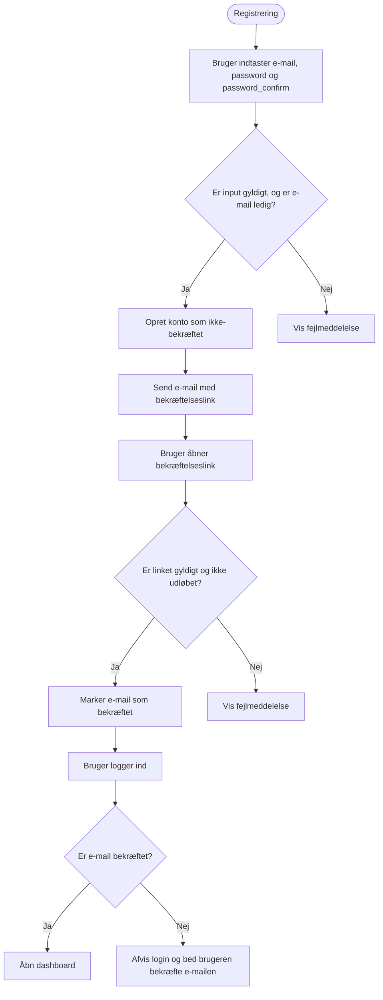

```mermaid
flowchart TD
    A([Registrering]) --> B[Bruger indtaster e-mail, password og password_confirm]
    B --> C{Er input gyldigt, og er e-mail ledig?}

    C -->|Ja| D[Opret konto som ikke-bekræftet]
    C -->|Nej| E[Vis fejlmeddelelse]

    D --> F[Send e-mail med bekræftelseslink]
    F --> G[Bruger åbner bekræftelseslink]
    G --> H{Er linket gyldigt og ikke udløbet?}

    H -->|Ja| I[Marker e-mail som bekræftet]
    H -->|Nej| J[Vis fejlmeddelelse]

    I --> K[Bruger logger ind]
    K --> L{Er e-mail bekræftet?}

    L -->|Ja| M[Åbn dashboard]
    L -->|Nej| N[Afvis login og bed brugeren bekræfte e-mailen]
```