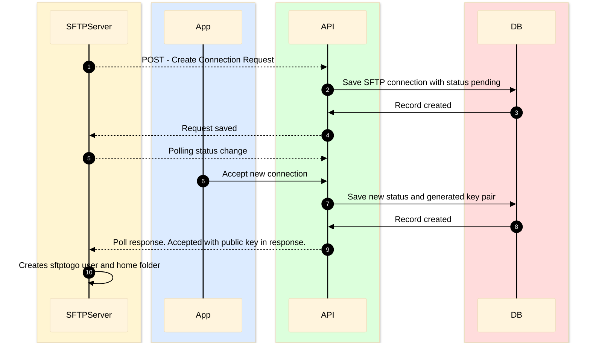

```mermaid
%%{init: {
  "theme": "base",
  "themeVariables": {
    "primaryTextColor": "#000000",
    "secondaryTextColor": "#000000",
    "lineColor": "#000000",
    "actorTextColor": "#000000",
    "actorLineColor": "#000000",
    "signalColor": "#000000",
    "signalTextColor": "#000000",
    "labelTextColor": "#000000",
    "noteTextColor": "#000000",
    "noteTextColor": "#000000"
  }
}}%%


sequenceDiagram
    autonumber

    box rgb(255,245,210) 
        participant SFTPServer 
    end

    box rgb(220,235,255) 
        participant App
    end

    box rgb(220,255,220)
        participant API
    end

    box rgb(255,220,220)
        participant DB
    end


SFTPServer-->>API: POST - Create Connection Request

API->>DB: Save SFTP connection with status pending

DB->>API: Record created

API-->>SFTPServer: Request saved

SFTPServer-->>API: Polling status change

App->>API: Accept new connection

API->>DB: Save new status and generated key pair

DB->>API: Record created

API-->>SFTPServer: Poll response. Accepted with public key in response.


SFTPServer->>SFTPServer: Creates sftptogo user and home folder
```