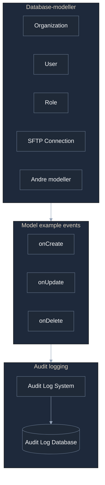

```mermaid
%%{init: {
  "theme": "base",
  "themeVariables": {
    "background": "#111827",
    "mainBkg": "#1F2937",
    "primaryColor": "#273449",
    "primaryTextColor": "#F9FAFB",
    "primaryBorderColor": "#64748B",
    "secondaryColor": "#263449",
    "secondaryTextColor": "#E5E7EB",
    "secondaryBorderColor": "#64748B",
    "tertiaryColor": "#1E293B",
    "lineColor": "#94A3B8",
    "textColor": "#F3F4F6"
  }
}}%%
flowchart TD
    subgraph Models["Database-modeller"]
        direction LR
        A["Organization"]
        B["User"]
        C["Role"]
        D["SFTP Connection"]
        E["Andre modeller"]
    end

    subgraph Events["Model example events"]
        direction LR
        F["onCreate"]
        G["onUpdate"]
        H["onDelete"]
    end

    subgraph Audit["Audit logging"]
        direction TD
        I["Audit Log System"]
        J[("Audit Log Database")]
        I --> J
    end

    Models --> Events
    Events --> Audit

```