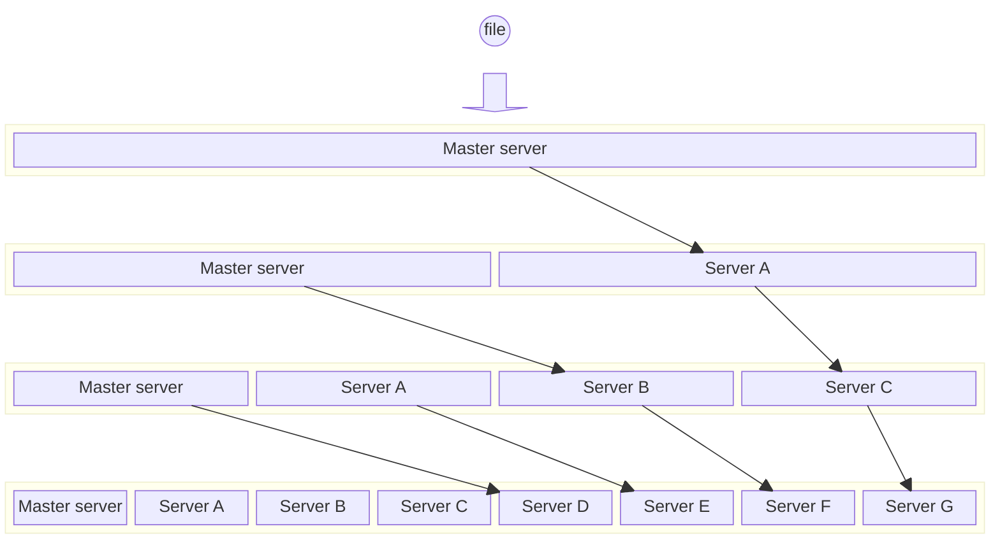

```mermaid
block
    columns 1
    db(("file"))
    blockArrowId6<["&nbsp;&nbsp;&nbsp;"]>(down)
    block
        A["Master server"]
    end
    space
    block
        B["Master server"]
        C["Server A"]
        A --> C
    end
    space
    block
        D["Master server"]
        E["Server A"]
        F["Server B"]
        G["Server C"]
        B --> F
        C --> G
    end
    space
    block
        H["Master server"]
        I["Server A"]
        J["Server B"]
        K["Server C"]
        L["Server D"]
        M["Server E"]
        N["Server F"]
        O["Server G"]
        D --> L
        E --> M
        F --> N
        G --> O
    end
```